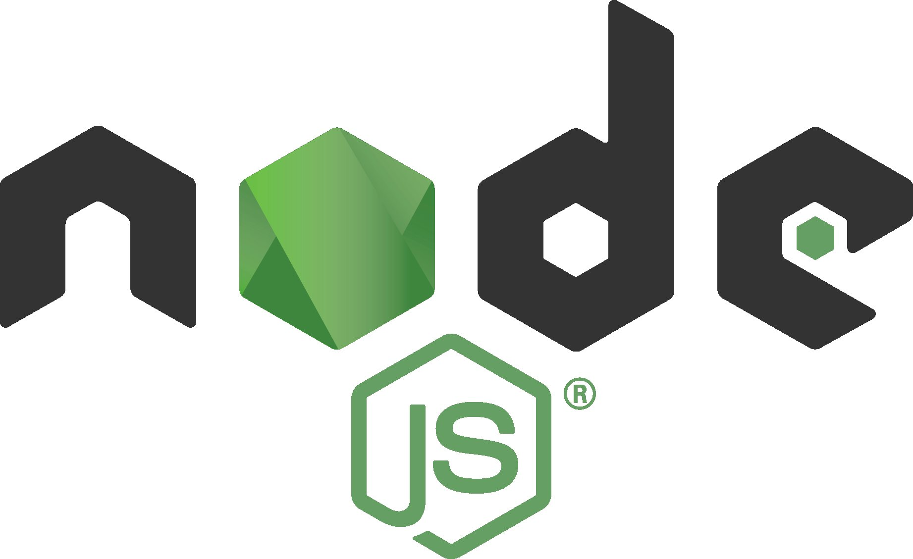
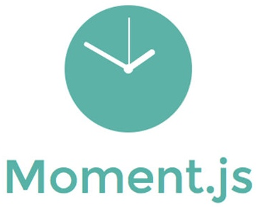
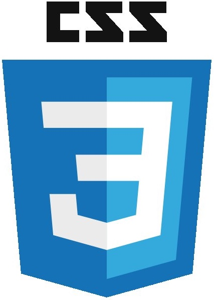
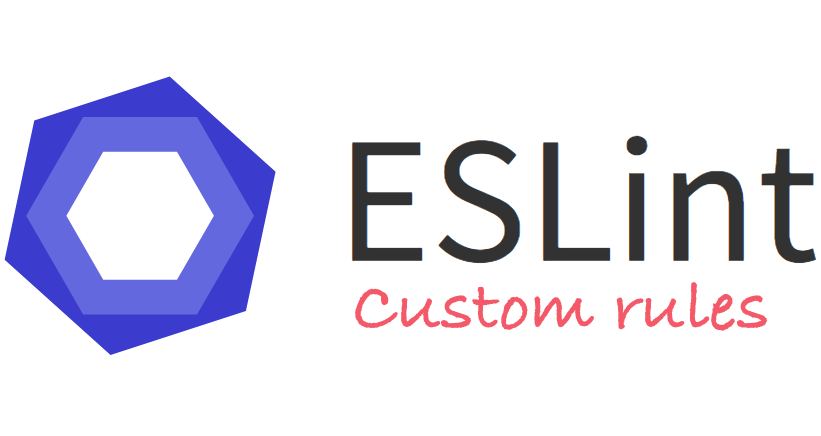
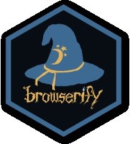
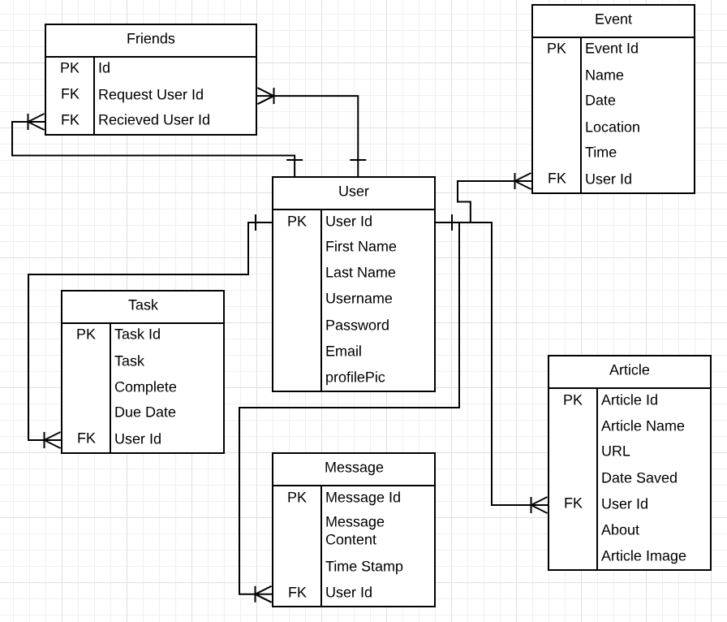

<h1 style="font-weight: bold; font-size: 8vw;text-align: center">Mission Control
<h1 style="font-weight: bold; margin-top: 0px;padding-top:0px;text-align: center">Nutshell: The Information Dashboard

<h3 style="text-align: center">Nutshell is a new product offering that you have been tasked with building. It's a dashboard for people to use to organize their daily tasks, events, news article, friends, and chat messages.

<h2 style="border-bottom: 1px solid white; text-align: center; font-weight: bold;"> Technologies Used
-
<div style="width: 100%;text-align: center;font-weight:bold; font-size: 3vw; ">Development Languages and Libraries

<section style="width:100%;display: flex; justify-content: center;flex-direction: row;">
<h3 style="display:flex; margin-right: 2%; margin-left: 2%;positon: relative; font-size: 1.5vw;text-align: center; width:10%;flex-direction: column; height: 25%;">Node.js
<h3 style="display:flex; margin-right: 2%;
margin-left: 2%; positon: relative; font-size: 1.5vw;text-align: center; width:10%;flex-direction: column; height: 25%;">Javascript
<h3 style="display:flex; margin-right: 2%;
margin-left: 2%; positon: relative; font-size: 1.5vw;text-align: center; width:10%;flex-direction: column; height: 25%;">jQuery
<h3 style="display:flex; margin-right: 2%;
margin-left: 2%; positon: relative; font-size: 1.5vw;text-align: center; width:10%;flex-direction: column; height: 25%;">Moment.js
<h3 style="display:flex; margin-right: 2%;
margin-left: 2%; positon: relative; font-size: 1.5vw;text-align: center; width:10%;flex-direction: column; height: 25%;">RESTful API
<h3 style="display:flex; margin-right: 2%;
margin-left: 2%; positon: relative; font-size: 1.5vw;text-align: center; width:10%;flex-direction: column; height: 25%;">HTML5
<h3 style="display:flex; margin-right: 2%;
margin-left: 2%; positon: relative; font-size: 1.5vw;text-align: center; width:10%;flex-direction: column; height: 25%;">CSS3</div>

<div style="width: 100%;text-align: center;font-weight:bold; font-size: 3vw; ">Development Tools

<section style="width:100%;display: flex; justify-content: center;flex-direction: row;">
<h3 style="display:flex; margin-right: 2%; margin-left: 2%;positon: relative; font-size: 1.5vw;text-align: center; width:10%;flex-direction: column; height: 25%;">ES Lint
<h3 style="display:flex; margin-right: 2%;
margin-left: 2%; positon: relative; font-size: 1.5vw;text-align: center; width:10%;flex-direction: column; height: 25%;">Grunt
<h3 style="display:flex; margin-right: 2%;
margin-left: 2%; positon: relative; font-size: 1.5vw;text-align: center; width:10%;flex-direction: column; height: 25%;">Browserify
<h3 style="display:flex; margin-right: 2%;
margin-left: 2%; positon: relative; font-size: 1.5vw;text-align: center; width:10%;flex-direction: column; height: 25%;">VS Code
<h3 style="display:flex; margin-right: 2%;
margin-left: 2%; positon: relative; font-size: 1.5vw;text-align: center; width:10%;flex-direction: column; height: 25%;">Lucid Chart
<h3 style="display:flex; margin-right: 2%;
margin-left: 2%; positon: relative; font-size: 1.5vw;text-align: center; width:10%;flex-direction: column; height: 25%;">Github
<h3 style="display:flex; margin-right: 2%;
margin-left: 2%; positon: relative; font-size: 1.5vw;text-align: center; width:10%;flex-direction: column; height: 25%;">Slack</div>


<h2 style="border-bottom: 1px solid white; text-align: center; font-weight: bold;">
 Instructions for Installing Mission Control
-
<h4> You will need to have command line tools installed for your computer to use terminal commands.
</h4>

  * Mac users - Open your terminal and type

    ```sh
    git --version
    ```

  * Linux/Windows users, please vist the [Git page](https://git-scm.com/book/en/v2/Getting-Started-Installing-Git) and follow the instructions for setup

<h4>You will now need to configure your git account. In the terminal window, type</h4>

  ```sh
  git config –global user.name “You Name”
  git config –global user.email “Your Email”
  ```

#### Create a new directory to store the files in. Type this into your terminal window.

  ```sh
  mkdir missionControl
  cd missionControl
  git clone https://github.com/nss-mission-control/nutshell.git
  ```

#### If you do not have Node.js installed on your machine, visit the [Node.js Download Page](https://nodejs.org/en/download/) and follow the included instructions. To ensure that it is installed correctly, in your terminal window, type

```sh
echo $PATH
```
  * Ensure that the result has the following in the $PATH

    ```sh
    /usr/local/bin
    ```
    or
    ```sh
    /usr/local/bin:/usr/bin:/bin:/usr/sbin:/sbin
    ```

#### You will need to go into the lib folder in your  directory and install and build npm modules and also your json-server. In your terminal, type

```sh
cd nutshell/src/lib
npm init
npm i
sudo npm install -g json-server
```

#### Now create a new directory inside the nutshell directory to store your JSON data. Type

```sh
cd ../..
mkdir api
touch api/database.json
```

### users

#### In order to create and edit the require JSON file, you will need a text editor. For this project, we used VS Code. Visit [VS Code](https://code.visualstudio.com) to install a copy.

#### Once you have a text editor installed, open the database.json file and paste the following test data.

```json
{
  "users": [
    {
      "id": 1,
      "firstName": "Kelly",
      "lastName": "Morin",
      "username": "kmorin06",
      "password": "1234NSS",
      "email": "kmorin06@gmail.com",
      "profilePic": "https://scontent-atl3-1.xx.fbcdn.net/v/t1.0-9/14100479_10157231480525062_191282433024935032_n.jpg?_nc_cat=102&_nc_ht=scontent-atl3-1.xx&oh=8ecc7dd157438c9c3d09c5c910ff4c61&oe=5C6FC0EA"
    },
    {
      "id": 2,
      "firstName": "Jase",
      "lastName": "Hackman",
      "username": "JaseTheGreat",
      "password": "MusicMan",
      "email": "jaseH@gmail.com",
      "profilePic": "https://avatars1.githubusercontent.com/u/42299515?s=400&v=4"
    },
    {
      "id": 3,
      "firstName": "Brendan",
      "lastName": " McCray",
      "username": "Brendan",
      "password": "CodeWhiz",
      "email": "brendanMc@gmail.com",
      "profilePic": "https://avatars0.githubusercontent.com/u/43763999?s=400&v=4"
    },
    {
      "id": 4,
      "firstName": "Brad",
      "lastName": "Davis",
      "username": "braddavistech",
      "password": "12345NSS",
      "email": "brad@braddavistech.com",
      "profilePic": "https://scontent-atl3-1.xx.fbcdn.net/v/t1.0-9/35884762_10211693141659337_7630947963367325696_n.jpg?_nc_cat=103&_nc_ht=scontent-atl3-1.xx&oh=ffc0c07db4711096066f9a4612ebff3c&oe=5C7CD0B2"
    }
  ],
  "messages": [
    {
      "id": 1,
      "messageContent": "Hi, first message.",
      "timeStamp": "2018-11-08T14:07:21.489Z",
      "userId": 1
    },
    {
      "id": 2,
      "messageContent": "I changed the message.",
      "timeStamp": "2018-11-09T12:10:34.489Z",
      "userId": 3
    },
    {
      "id": 3,
      "messageContent": "You get the idea.",
      "timeStamp": "2018-11-07T21:16:34.489Z",
      "userId": 2
    },
    {
      "messageContent": "This makes a better message",
      "timeStamp": "2018-11-10T09:16:34.489Z",
      "userId": 4,
      "id": 4
    }
  ],
   "articles": [
    {
      "articleName": "In East Palo Alto, the influx of tech companies pushes residents to a breaking point over gentrification",
      "url": "https://www.mercurynews.com/2018/11/05/in-east-palo-alto-the-influx-of-tech-companies-pushes-residents-to-a-breaking-point-over-gentrification/",
      "articleImage": "https://www.mercurynews.com/wp-content/uploads/2018/11/In_East_Palo_Alto_the_influx_of_tech_companies_pushes_residents_to_a_breaking_point_over_gentrification1.jpg?w=863",
      "dateSaved": "2018-10-09T21:18:52.339Z",
      "about": "kasjkhdiuahofajbe;kj[orebifjbqPEK",
      "userId": 4,
      "id": 1
    },
    {
      "articleName": "Tensions rising between Mueller, Manafort over level of cooperation: Sources",
      "url": "https://abcnews.go.com/Politics/tensions-rising-mueller-manafort-level-cooperation-sources/story?id=59086047",
      "articleImage": "https://s.abcnews.com/images/Politics/robert-mueller-ap-file-ps-180920_hpEmbed_4_22x15_992.jpg",
      "dateSaved": "2018-11-09T21:07:05.773Z",
      "about": "Something about politics",
      "userId": 3,
      "id": 2
    },
    {
      "articleName": "FIRE FIRE",
      "url": "https://www.newschannel5.com/news/tennessee-american-red-cross-volunteers-help-wildfire-victims",
      "articleImage": "https://mediaassets.newschannel5.com/photo/2018/11/12/RedCrosslocal_1542050078840_102998400_ver1.0_640_480.jpg",
      "about": "WE DIDN'T START THE FIYAAAA",
      "userId": 4,
      "dateSaved": "2018-11-12T19:35:56.249Z",
      "id": 3
    }
   ],
   "events": [
    {
      "id": 1,
      "name": "Fancy",
      "date": "2014-09-09",
      "location": "Here",
      "time": "03:02",
      "userId": 2
    },
    {
      "name": "Soccer Practice Today",
      "date": "2018-11-02",
      "time": "22:11",
      "location": "The Field",
      "userId": 2,
      "id": 2
    },
    {
      "name": "Sleep",
      "date": "2018-11-15",
      "time": "",
      "location": "My Bed",
      "userId": 3,
      "id": 3
    },
    {
      "name": "Class",
      "date": "2018-11-12",
      "time": "09:05",
      "location": "NSS",
      "userId": 1,
      "id": 4
    }
   ],
   "tasks": [
    {
      "task": "test again",
      "complete": true,
      "dueDate": "2018-11-12",
      "userId": 2,
      "id": 1
    },
    {
      "task": "Finish MVP",
      "complete": true,
      "dueDate": "2018-11-11",
      "userId": 4,
      "id": 2
    },
    {
      "task": "Finish project",
      "complete": true,
      "dueDate": "2018-11-09",
      "userId": 2,
      "id": 3
    },
    {
      "task": "Here is a new task",
      "complete": true,
      "dueDate": "2018-11-29",
      "userId": 4,
      "id": 4
    }
   ],
  "friends": [
    {
      "id": 1,
      "request_userId": 2,
      "userId": 1
    },
    {
      "id": 3,
      "request_userId": 3,
      "userId": 2
    },
    {
      "request_userId": 1,
      "userId": 3,
      "id": 4
    },
    {
      "request_userId": 1,
      "userId": 2,
      "id": 5
    }
  ]
}
```

#### From your terminal window, type

```sh
cd src/lib
npm start
```
#### Now that the server is up and running, you can open an internet browser and access the application:
```sh
http://localhost:8080/
```

#### The database can be accessed by entering the following in the url bar.

```sh
http://localhost:8088/
```

<h1 style="text-align:center; font-weight: bold;">Congratulations! You are now experiencing Mission Control!

<h2 style="font-weight:bold;text-align:center" > Topics Covered Building Mission Control</h2>

<h2 style="text-align: center">We covered numerous topics in the execution of this project which include:</h2>

1. Functions
1. Stand-Up meetings
1. ERD Diagrams
1. Databases/API
1. Github
1. Objects
1. CSS
1. Handling user events
1. Factory functions
1. Data entry/editing
1. Modular code with Browserify
1. Relational data


<h2 style="text-align: center">Entity Relationship Diagrams
-


<h2 style="font-weight:bold;text-align: center"> Professional Requirements</h2>

1. All teammates must be using Grunt to run ESLint and Browserify during development
1. Each module should have a comment at the top with the following info: author(s) and purpose of module
1. The README for your project should include instructions on how another person can download and run the application

<h2 style="font-weight:bold;text-align: center">How to Handle Authentication</h2>

Session storage was used to store the current user at login and makeAPI calls in relation to the value stored. While we stored an object that represents the information on the user, in the future, we would only recommend storing the user id.

```js
sessionStorage.setItem("currentUser", JSON.stringify(currentUser));
```

If you want to add a Logout feature, all you need to do it remove the session storage item.

```js
sessionStorage.removeItem("currentUser");
```

<h2 style="text-align: center; font-weight: bold"> Visual Feature List</h2>

<h3 style="text-align: center">To help you along, here is a visualization of the features, and behaviors of the application to get you started.</h3>


